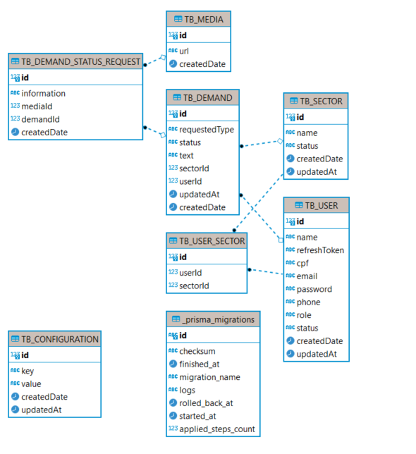

<h1>Projeto de um Sistema de Requisições</h1>

<h2>Padrões de Commits</h2>

No projeto, utilizo os seguintes padrões de commits:

<h3>Prefixos:</h3>
    <ul>
        <li><strong>FIX:</strong> Utilizado para resolução de bugs.</li>
        <li><strong>FEAT:</strong> Usado quando iniciamos a implementação de uma nova feature.</li>
        <li><strong>CHORE:</strong> Indica trabalho em progresso em uma feature.</li>
        <li><strong>TEST:</strong> Utilizado ao implementar testes.</li>
    </ul>

<h3>Estrutura de Commits:</h3>
    <ul>
        <li><strong>PREFIXO[feature/branch-name]:</strong> Descrição do que foi adicionado nesta feature.</li>
        <li><strong>PREFIXO[hotfix/branch-name]:</strong> Descrição do que foi ajustado neste hotfix.</li>
        <li><strong>PREFIXO[bugfix/branch-name]:</strong> Descrição do que foi corrigido neste bugfix.</li>
        <li><strong>PREFIXO[release/version]:</strong> Descrição do que foi lançado nesta versão.</li>
    </ul>

<h2>Para realizar um teste prático</h2>

<ol>
    <li>Clone o repositório usando o seguinte comando:</li>
    <pre><code>git clone <URL_DO_REPOSITÓRIO></code></pre>

<li>Instale as dependências usando o comando:</li>
    <pre><code>yarn install</code></pre>

<li>Na raiz do projeto, crie o arquivo <strong>.env</strong>, seguindo o modelo abaixo:</li>
    <pre><code>&lt;cole aqui as suas configurações&gt;</code></pre>

<li>Para rodar o backend, execute:</li>
    <pre><code>docker-compose up</code></pre>
    
Caso queira tentar sem o Docker, execute:

    <pre><code>yarn dev</code></pre>

<li>Para rodar as migrações, execute:</li>
    <pre><code>yarn migration</code></pre>
    
É possível que seja necessário executar antes:

    <pre><code>yarn generate</code></pre>

<li>Verifique se você possui <strong>docker/docker-compose</strong> instalados e execute os testes com o Jest usando:</li>
    <pre><code>yarn test</code></pre>
</ol>

<h4>Node version: v19.8.1</h4>

 
<h3>Mer and Der:</h3>
